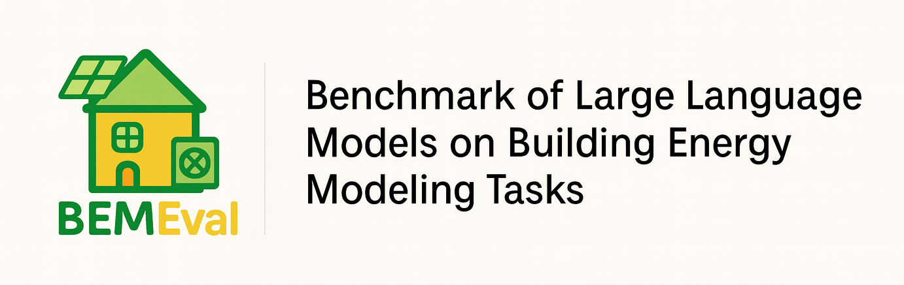

<p align="center">
  
</p>

# 🏠 BEMEval-Res

**Benchmark for Evaluating LLM Performance in Residential Building Energy Modeling**

[](LICENSE)
[]()
[]()
[]()

---

### 📘 Overview
**BEMEval-Res** is the residential benchmark of the open-source **BEMEval** framework — a standardized dataset and evaluation suite for evaluating large language models (LLMs) performance on **building energy modeling (BEM)** tasks.

The benchmark focuses on translating *unstructured building descriptions* into *structured/machine-readable energy modeling schemas*, enabling consistent and reproducible evaluation of AI models in the BEM domain.

---

### 📁 Folder Structure

```
bemeval-res/
├── data/
│   ├── datasets/          # Benchmark building cases
│   │   ├── l100/          # HERS L100 test case
│   │   │   ├── input/     # Building descriptions (text)
│   │   │   └── output/    # HPXML reference outputs
│   │   ├── nzertf/        # NIST Net-Zero Energy Residential Test Facility
│   │   │   ├── input/     # Building specifications (xlsx)
│   │   │   └── output/    # HPXML reference outputs
│   │   └── iunit/         # NREL iUnit (multifamily)
│   │       ├── input/     # Building specifications (xlsx)
│   │       └── output/    # EPC-Schema reference outputs (TOML)
│   └── metadata/          # Schema definitions and references
│       ├── epc-schema/    # EPC-Schema specification
│       │   ├── epc_schema.json
│       │   ├── epc_schema_descriptions.json
│       │   └── references/  # Supporting documentation and diagrams
│       └── hpxml/         # HPXML schema files
│           ├── HPXML.xsd
│           └── HPXML.txt
├── evaluation/            # Evaluation scripts and metrics
│   ├── __init__.py
│   └── evaluate.py        # KVOR metric implementation
├── docs/                  # Documentation
│   └── getting_started.md
└── pyproject.toml        # Project configuration
```

---

### 🧩 Key Features
- **Multiple Schemas** – Includes both **industry** and **research** schemas:
  - [HPXML](https://hpxml.nrel.gov/) – consensus residential schema for home energy modeling
  - **EPC-Schema** – customized normative schema based on ISO/CEN 13790 energy performance methods
- **Representative Building Cases** – curated building descriptions from:
  - HERS L100 test case
  - NIST NZERTF (single-family)
  - NREL iUnit (apartment/multifamily)
- **Evaluation Metrics**
  - Key–Value Overlap Rate (KVOR)


---

