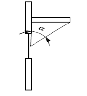
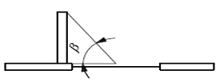
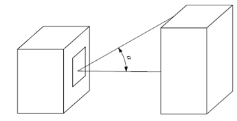
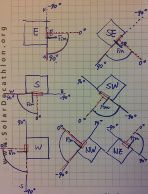

## Shading Reduction Factor

### Angles for Overhang, Fin, and Horizon Obstacle

| Diagram | Description |
|----------|--------------|
|  | **Vertical section for Overhang Angle, α** |
|  | **Horizontal section for Fin Angle, β** |
|  | **Horizon Angle, α** |
|  | Example orientations for E, S, W, NE, NW, SE, SW windows |

**NOTE:**
- For *east* and *west*-facing windows, the shading correction factor is valid for fins at the **south end** of the window.
- For *south*-facing windows, the shading reduction is valid for fins at the **west end** of the window.
- For *north*-facing windows, the shading reduction is valid for fins at the **east end** of the window.

---

### Shading Reduction Factor from Internal or External Shading Devices
**(Blind or Curtain)**

[Table] *Shading Reduction Factor for sliding device*
<Source: ISO 13790 Annex G.5.2>

| Curtain Type | Reduction Factor (Curtain Inside) | Reduction Factor (Curtain Outside) |
|---------------|-----------------------------------|------------------------------------|
| White Venetian Blinds | 0.25 / 0.30 / 0.45 | 0.10 / 0.15 / 0.35 |
| White Curtains | 0.65 / 0.80 / 0.95 | 0.55 / 0.75 / 0.95 |
| Coloured Textiles | 0.42 / 0.57 | 0.17 / 0.37 |
| Aluminium-Coated Textiles | 0.20 | 0.08 |
